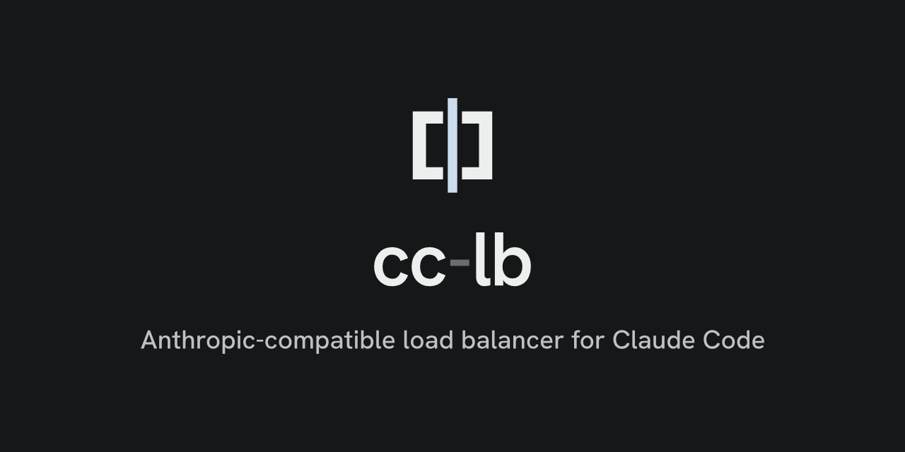
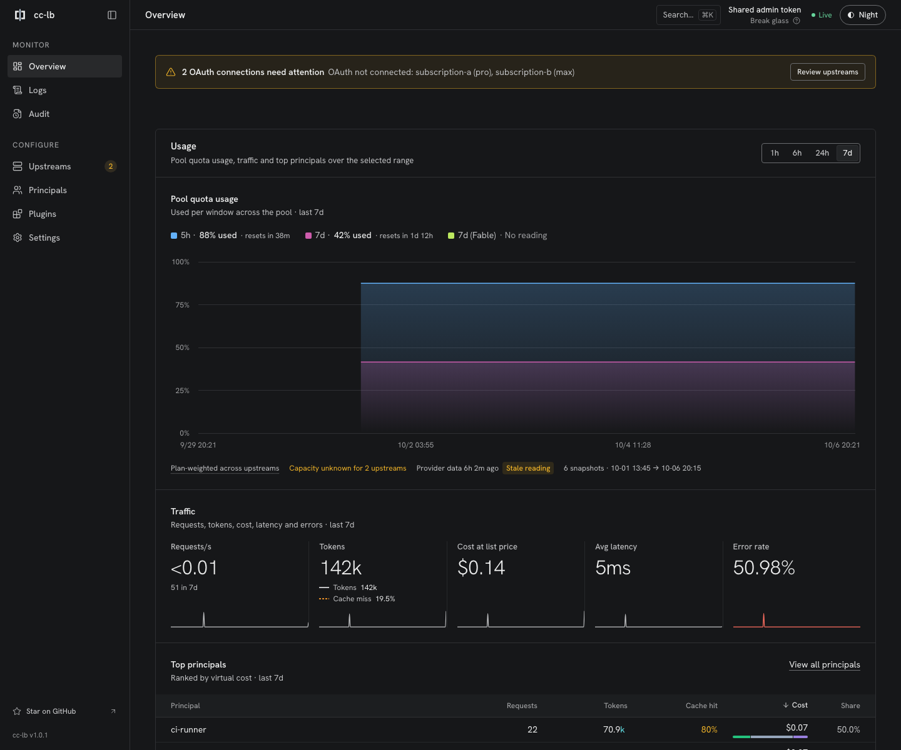
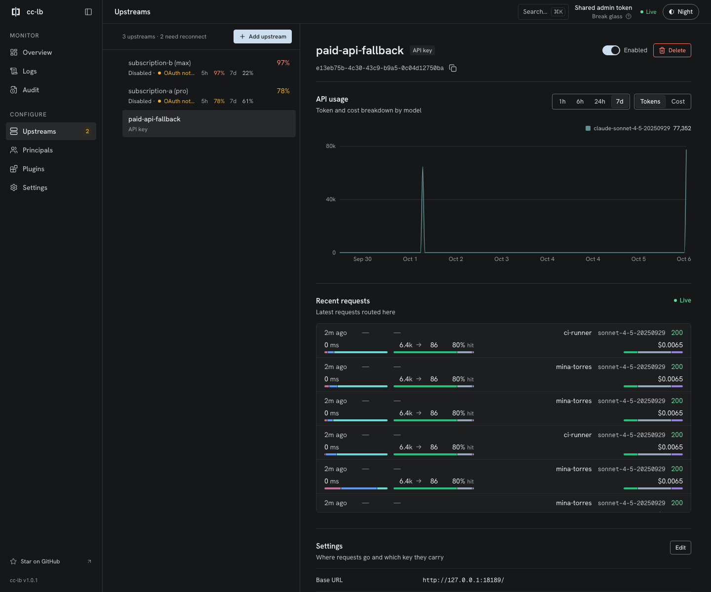
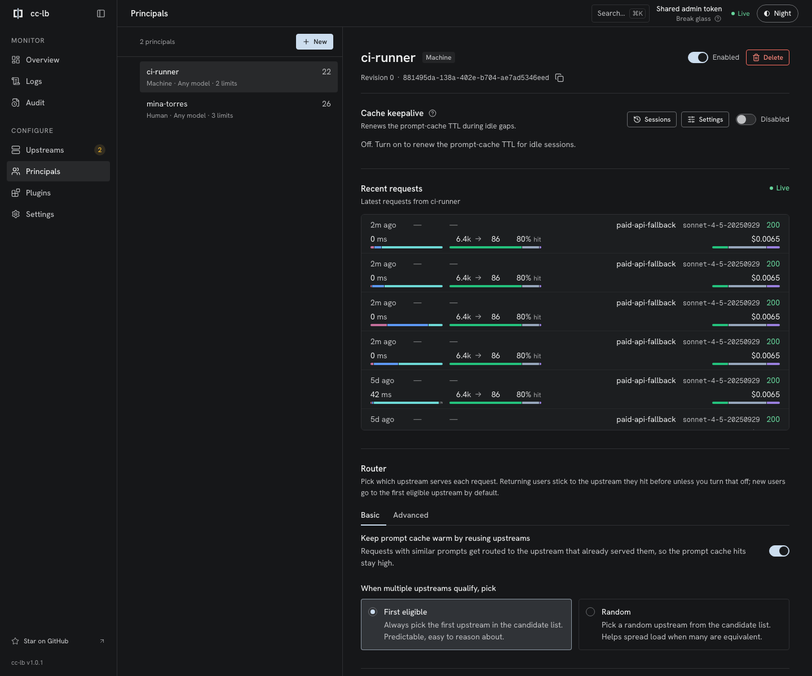
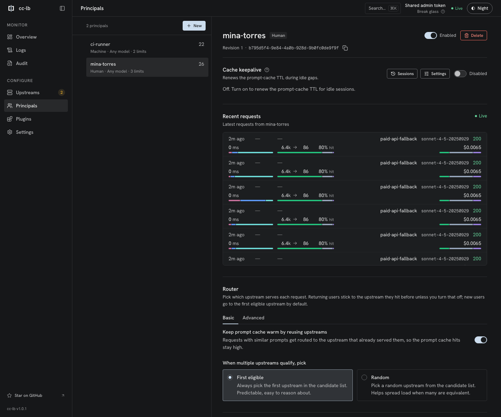
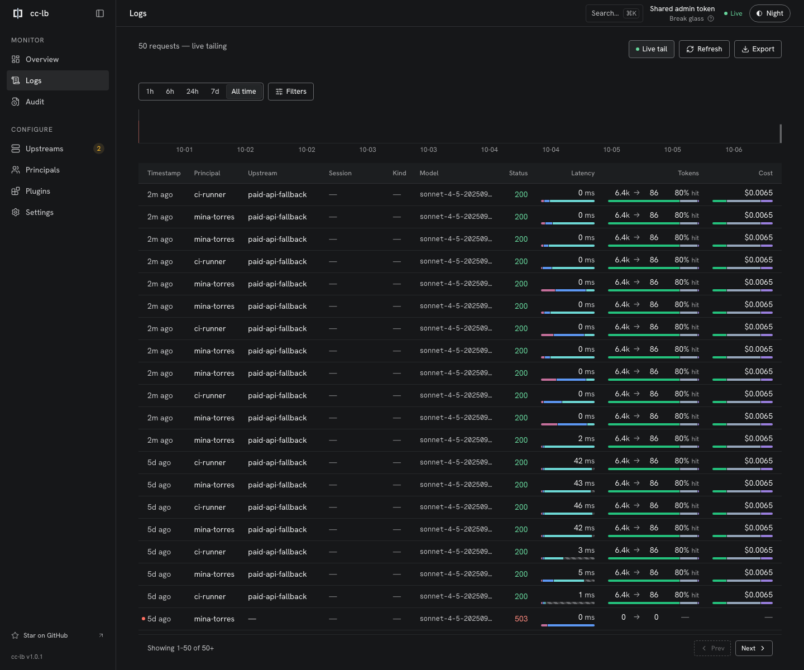

<p align="center">
  <picture>
    <source media="(prefers-color-scheme: dark)" srcset="assets/brand/social/cc-lb-social-preview.png">
    
  </picture>
</p>

# cc-lb

Self-hosted Anthropic-compatible reverse proxy and load balancer for pooled API-key and OAuth upstreams.

[Website](https://cc-lb.bhyoo.com/) · [Docs](https://cc-lb.bhyoo.com/docs/getting-started/) · [Install](https://cc-lb.bhyoo.com/docs/getting-started/install/) · [Changelog](./CHANGELOG.md) · [Contributing](./.github/CONTRIBUTING.md) · [Security](./.github/SECURITY.md) · [Runtime management](./docs/runtime-management.md) · [Plugin author guide](./docs/plugin-author-guide.md) · [License](./LICENSE)

cc-lb is an operator-managed endpoint for Anthropic-compatible traffic. It keeps upstreams, principals, proxy keys, routing state, and plugin chains in the database so operators can update runtime state without rebuilding the binary.

## Supported scope

The current public upstream contract supports:

- `anthropic_api_key`: an operator-configured Anthropic API-key upstream.
- `anthropic_oauth`: an Anthropic OAuth upstream managed through the admin surface.

Other provider kinds are not part of the current supported scope. cc-lb is an independent project and is not affiliated with or endorsed by Anthropic.

## Request flow

1. An operator creates an upstream and principal through the dashboard or the authenticated admin API, then issues a proxy key for that principal.
2. A client sends an Anthropic Messages API request to `POST /v1/messages` with the proxy key.
3. cc-lb authenticates the principal, selects from enabled compatible upstream candidates, and forwards the request. Responses may be streamed back to the client.

After setup, a small request-path check looks like this:

```bash
curl -sS http://localhost:8080/v1/messages \
  -H "x-api-key: $CC_LB_PROXY_KEY" \
  -H "anthropic-version: 2023-06-01" \
  -H "content-type: application/json" \
  -d '{"model":"claude-sonnet-4-5-20250929","max_tokens":16,"messages":[{"role":"user","content":"ping"}]}'
```

Use a model allowed by the principal and inspect the response stream or the stream diagnostics below.

## Screenshots

These are real cc-lb 1.0.1 admin UI screens captured with synthetic fixture data, not production telemetry. The requests shown went through the proxy to a local mock upstream.

| Overview | Upstreams |
| --- | --- |
|  |  |
| **Principals** | **Principal detail** |
|  |  |
| **Logs** | |
|  | |

## Quick start

This path runs the published container image; no Git checkout or Rust toolchain is needed. To build from source instead, see [Contributing](./.github/CONTRIBUTING.md).

Start in a new directory. Keep the master key with the persisted data and reuse it when restarting an existing instance.

Prerequisites:

- Docker with a running daemon;
- `curl` and `jq` to resolve the release version; and
- OpenSSL to generate local secrets.

Resolve the latest stable server release and derive the image tag. Server releases are tagged `cc-lb-v<version>` and the image tag is the version without the `cc-lb-v` prefix; the registry does not publish a `:latest` tag.

```bash
CC_LB_VERSION="$(
  curl -fsSL "https://api.github.com/repos/isac322/cc-lb/releases?per_page=100" \
    | jq -r 'first(.[] | select(.draft == false and .prerelease == false and (.tag_name | startswith("cc-lb-v")))) | .tag_name | ltrimstr("cc-lb-v")'
)"
CC_LB_IMAGE="ghcr.io/isac322/cc-lb:${CC_LB_VERSION}"
```

Generate the master key and admin token into a local `.env` file without printing them, then add your upstream credential:

```bash
umask 077
{
  printf 'CC_LB_MASTER_KEY=%s\n' "$(openssl rand -hex 32)"
  printf 'CC_LB_ADMIN_TOKEN=%s\n' "$(openssl rand -hex 24)"
  printf 'ANTHROPIC_API_KEY=%s\n' "replace-with-your-upstream-secret"
} > .env
```

Edit `.env` and replace the `ANTHROPIC_API_KEY` placeholder with a real Anthropic API key. The container reads it from the server process environment when you create an `anthropic_api_key` upstream (see the [install guide](https://cc-lb.bhyoo.com/docs/getting-started/install/)). Keep the file out of source control.

Create the container configuration `cc-lb.container.toml`:

```toml
[runtime]
data_dir = "/var/lib/cc-lb/data"

[listener]
proxy_addr = "0.0.0.0:8080"
admin_addr = "0.0.0.0:9090"
metrics_addr = "0.0.0.0:9091"

[storage]
kind = "sqlite"
path = "/var/lib/cc-lb/storage.sqlite"

[aead]
key_env = "CC_LB_MASTER_KEY"

[[admin.auth.providers]]
kind = "static_token"
id = "local"
token_env = "CC_LB_ADMIN_TOKEN"
```

Create a persistent host data directory and validate the configuration inside the image:

```bash
mkdir -p ./data

docker run --rm \
  --user "$(id -u):$(id -g)" \
  --env-file .env \
  -v "$PWD/cc-lb.container.toml:/etc/cc-lb/cc-lb.toml:ro" \
  -v "$PWD/data:/var/lib/cc-lb" \
  "$CC_LB_IMAGE" config validate --config /etc/cc-lb/cc-lb.toml
```

Start the server. The container listeners bind all interfaces, while the published host ports below expose the proxy, admin, and metrics endpoints on IPv4 loopback only; the image runs as the current host user so SQLite and runtime state persist through the bind mount:

```bash
docker run --rm --name cc-lb \
  --user "$(id -u):$(id -g)" \
  --env-file .env \
  -p 127.0.0.1:8080:8080 \
  -p 127.0.0.1:9090:9090 \
  -p 127.0.0.1:9091:9091 \
  -v "$PWD/cc-lb.container.toml:/etc/cc-lb/cc-lb.toml:ro" \
  -v "$PWD/data:/var/lib/cc-lb" \
  "$CC_LB_IMAGE"
```

The image's default command is `serve --config /etc/cc-lb/cc-lb.toml`, matching the read-only mount above.

Create a database-backed upstream with `POST /admin/v1/upstreams`, create a principal with `POST /admin/v1/principals`, and issue its proxy key with `POST /admin/v1/principals/{id}/keys`. Use the admin Bearer token from `CC_LB_ADMIN_TOKEN`. With this container's loopback-only port publishing, the admin API and dashboard are at `http://127.0.0.1:9090/`; a native source build with default listeners uses `http://[::1]:9090/` instead.

With an empty database, `/healthz` returns `200` while `/readyz` returns `503` with `no_ready_principal`. Configure a principal and an upstream through the admin API or dashboard before sending client requests.

See the [install and configure guide](https://cc-lb.bhyoo.com/docs/getting-started/install/) for request bodies and [Runtime Management](./docs/runtime-management.md) for the full API and the architecture.

## Operator guides

- [Runtime management](./docs/runtime-management.md): database-backed upstreams, principals, keys, and plugin chains
- [Upstream warm-up](./docs/upstream-warmup.md): OAuth warm-up and quota-aware scheduling
- [Distributed scheduler](./docs/scheduler.md): topology, retry classes, metrics, and runbook
- [Plugin author guide](./docs/plugin-author-guide.md): Wasmtime filter and shape hooks

### Stream diagnostics

HTTP 200 means response headers were sent, not that the response body completed. Use `cc_lb_stream_terminations_total{outcome,cause}` to distinguish `completed`, `upstream_error`, `proxy_error`, and `client_cancelled`. Causes are bounded categories such as `unexpected_eof`, `h2_cancel`, and `affinity_error`; request IDs and error messages are never metric labels.

With OTLP enabled, `proxy.response_stream` spans remain open until the response body ends or is dropped. Transport failures record a bounded, redacted `error.chain` and, when available, `error.io.kind`, `error.io.os_error`, and `error.h2.reason`. These describe the failed response path, not necessarily which party caused the disconnect.

`cc_lb_requests_started_total` counts proxied requests when proxy response headers are sent, including locally generated responses. `cc_lb_request_headers_duration_seconds` measures request-start-to-header latency for those responses. Neither metric measures terminal completion.

The `proxy.handle` span stays open through terminal lifecycle completion and records:

- `cc_lb.request.retry_count` and final-attempt `cc_lb.upstream.bulkhead_wait_ms`, `cc_lb.upstream.dns_ms`, `cc_lb.upstream.connect_ms`, `cc_lb.upstream.connection_reused`, `cc_lb.upstream.shape_ms`, `cc_lb.upstream.sign_ms`, and `cc_lb.upstream.ttfb_ms`. Upstream timings are not totals across retries.
- `cc_lb.response.first_body_chunk_ms` for transport arrival, and `cc_lb.response.first_content_delta_ms` for consumer TTFT. A body chunk or metadata-only SSE event need not contain a content delta.
- Observed scalar token fields `gen_ai.usage.input_tokens`, `gen_ai.usage.output_tokens`, `gen_ai.usage.cache_creation_input_tokens`, and `gen_ai.usage.cache_read_input_tokens`. `cc_lb.usage.completeness` is `complete` only for complete usage without a terminal error; otherwise it is `partial`. Usage attributes contain no raw bodies and make no cost claims.
- Terminal `cc_lb.request.outcome` (`success`, `client_cancelled`, `error`, or `timeout`), `cc_lb.request.duration_ms`, `cc_lb.request.finalize_ms`, and `cc_lb.request.unaccounted_ms`.

Admin HTTP requests use a separate `admin.request` span with bounded matched-route templates, response status/error categories, and optional request-ID correlation, not raw paths, query strings, authentication headers, credentials, or bodies. Request IDs are span attributes, never metric labels. Instrumentation creates no per-chunk child spans and does not wait for telemetry export on the request path; this is not a zero-overhead guarantee. See the [Prometheus and OTLP contract](./docs/request-latency-unaccounted-remediation.md#13-prometheus-and-otlp-contract) for timing boundaries and residual computation.

The `stream latency breakdown` log runs on a dedicated worker with a fixed 4,096-entry queue, so emitting it cannot delay the final downstream body bytes. Queue overflow and closure increment `cc_lb_dropped_events_total` with bounded `stream_completion_observer_*` reasons; panic accounting and recovery apply to unwind builds, while the release profile aborts native Rust panics. Mandatory lifecycle events, accounting, affinity decisions, and stream termination metrics remain inline. Graceful server shutdown prioritizes durable writer flushes, then waits up to the existing cleanup budget for remaining stream completion logs before telemetry teardown; a timeout increments `stream_completion_observer_shutdown_timeout` and leaves the worker detached.

## Plugin authors

Plugins are Wasm modules authored with the published `cc-lb-pdk-wasmtime`; bundled guest plugins depend only on that PDK, which re-exports the guest-facing wire API from `cc-lb-plugin-wire`. The wire-only `cc-lb-runtime-wasmtime` runtime compiles each upload with Wasmtime 48, validates imports, required plugin and hook metadata, per-hook wire versions, per-hook BLAKE3 layout fingerprints, and an upload-time runtime probe before dispatching calls. Each published hook currently uses wire version 1. Local execution defaults to on-demand allocation with fresh per-call `Store`s, per-store `StoreLimits`, and a process-wide store budget; operators can opt into Wasmtime pooling through `[runtime.wasmtime] allocation_strategy = "pooling"`.

The slots a plugin may target:

- **filter**: return a `FilterResponse` deciding which upstream candidates to keep. The V1 filter request exposes the requested `service_tier`.
- **shape**: unified slot that transforms the incoming request into an upstream-bound `ShapedRequest`, and transforms downstream responses (both buffered and SSE). A shape plugin must implement request shaping, buffered response transform, and SSE event transform, with explicit no-op handlers for unneeded response hooks.

The published crates.io set is `cc-lb-plugin-wire`, `cc-lb-pdk-wasmtime-macros`, `cc-lb-pdk-wasmtime`, `cc-lb-runtime-wasmtime`, and `cc-lb-plugin-conformance`. Start with [docs/plugin-author-guide.md](./docs/plugin-author-guide.md), then use the crate READMEs for focused API notes: [`cc-lb-plugin-wire`](./crates/cc-lb-plugin-wire/README.md), [`cc-lb-pdk-wasmtime-macros`](./crates/cc-lb-pdk-wasmtime-macros/README.md), [`cc-lb-pdk-wasmtime`](./crates/cc-lb-pdk-wasmtime/README.md), [`cc-lb-runtime-wasmtime`](./crates/cc-lb-runtime-wasmtime/README.md), and [`cc-lb-plugin-conformance`](./crates/cc-lb-plugin-conformance/README.md). Runtime design background is in the historical [RFC-0001](./docs/rfc/0001-plugin-runtime-vnext.md).

Upload flow: build the plugin to `wasm32-unknown-unknown`, then POST the artifact to `POST /admin/v1/plugins/wasm`. The host runs `admit_wasm`, derives the supported slots from the exported hooks, persists the SHA-256, plugin metadata name/version, plugin description, plugin usage, and per-hook metadata, then triggers a dynamic-view rebind. Re-uploading the same plugin name and SHA is a successful noop; uploading the same metadata name with a higher semantic version replaces the existing registry row in place; same/lower version replacements require an explicit confirmation retry. Registry reference counts include both plugin-chain bindings and upstream warmup dialect plugin bindings.

## License

cc-lb is licensed under [Apache-2.0](./LICENSE).
