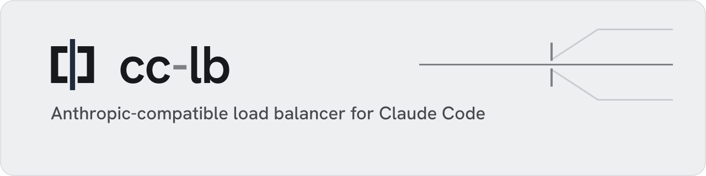

<p align="center">
  <picture>
    <source media="(prefers-color-scheme: dark)" srcset="assets/brand/readme/cc-lb-hero-dark.svg">
    
  </picture>
</p>

# cc-lb

Self-hosted Anthropic-compatible reverse proxy and load balancer for pooled API-key and OAuth upstreams.

[Website](https://cc-lb.bhyoo.com/) · [Runtime management](./docs/runtime-management.md) · [Plugin author guide](./docs/plugin-author-guide.md) · [License](./LICENSE)

cc-lb is an operator-managed endpoint for Anthropic-compatible traffic. It keeps upstreams, principals, proxy keys, routing state, and plugin chains in the database so operators can update runtime state without rebuilding the binary.

## Supported scope

The current public upstream contract supports:

- `anthropic_api_key`: an operator-configured Anthropic API-key upstream.
- `anthropic_oauth`: an Anthropic OAuth upstream managed through the admin surface.

Other provider kinds are not part of the current supported scope. cc-lb is an independent project and is not affiliated with or endorsed by Anthropic.

## Request flow

1. An operator creates an upstream and principal through the dashboard or the authenticated admin API, then issues a proxy key for that principal.
2. A client sends an Anthropic Messages API request to `POST /v1/messages` with the proxy key.
3. cc-lb authenticates the principal, selects from enabled compatible upstream candidates, and forwards the request. Responses may be streamed back to the client.

After setup, a small request-path check looks like this:

```bash
curl -sS http://localhost:8080/v1/messages \
  -H "x-api-key: $CC_LB_PROXY_KEY" \
  -H "anthropic-version: 2023-06-01" \
  -H "content-type: application/json" \
  -d '{"model":"claude-sonnet-4-5-20250929","max_tokens":16,"messages":[{"role":"user","content":"ping"}]}'
```

Use a model allowed by the principal and inspect the response stream or the stream diagnostics below.

## Quick start

Prerequisites for a local build:

- Rust 1.98.1 from `rust-toolchain.toml`;
- Bun 1.3.14 or newer for the admin SPA build; and
- the `wasm32-unknown-unknown` Rust target for bundled Wasmtime fixtures.

Install the target before building:

```bash
rustup target add wasm32-unknown-unknown
```

The server build invokes both the admin SPA and Wasm fixture builds. For a server-only build without fixture compilation, set `CC_LB_SKIP_WASM_FIXTURE_BUILD=1`; the admin SPA still requires Bun unless a prebuilt SPA is supplied.

Build the server binary:


```bash
cargo build --release -p cc-lb-server
```

Set the master key, admin token, and an upstream credential:

```bash
export CC_LB_MASTER_KEY=$(openssl rand -hex 32)
export CC_LB_ADMIN_TOKEN=$(openssl rand -hex 24)
export ANTHROPIC_API_KEY=sk-ant-api03-...
```

```bash
mkdir -p ./data
```

Create a local `cc-lb.toml`:

```toml
[storage]
kind = "sqlite"
path = "./data/storage.sqlite"

[aead]
key_env = "CC_LB_MASTER_KEY"

[[admin.auth.providers]]
kind = "static_token"
id = "local"
token_env = "CC_LB_ADMIN_TOKEN"
```

Start the server with the `cc-lb` executable:

```bash
./target/release/cc-lb serve \
  --config cc-lb.toml \
  --data-dir ./data/runtime
```

Create a database-backed upstream with `POST /admin/v1/upstreams`, create a principal with `POST /admin/v1/principals`, and issue its proxy key with `POST /admin/v1/principals/{id}/keys`. Use the admin Bearer token from `CC_LB_ADMIN_TOKEN`. The dashboard is available at `http://[::1]:9090/`.

See [Runtime Management](./docs/runtime-management.md) for request bodies, the full API, and the architecture.

## Operator guides

- [Runtime management](./docs/runtime-management.md): database-backed upstreams, principals, keys, and plugin chains
- [Upstream warm-up](./docs/upstream-warmup.md): OAuth warm-up and quota-aware scheduling
- [Distributed scheduler](./docs/scheduler.md): topology, retry classes, metrics, and runbook
- [Plugin author guide](./docs/plugin-author-guide.md): Wasmtime filter and shape hooks

### Stream diagnostics

HTTP 200 means response headers were sent, not that the response body completed. Use `cc_lb_stream_terminations_total{outcome,cause}` to distinguish `completed`, `upstream_error`, `proxy_error`, and `client_cancelled`. Causes are bounded categories such as `unexpected_eof`, `h2_cancel`, and `affinity_error`; request IDs and error messages are never metric labels.

With OTLP enabled, `proxy.response_stream` spans remain open until the response body ends or is dropped. Transport failures record a bounded, redacted `error.chain` and, when available, `error.io.kind`, `error.io.os_error`, and `error.h2.reason`. These describe the failed response path, not necessarily which party caused the disconnect.

The `stream latency breakdown` log runs on a dedicated worker with a fixed 4,096-entry queue, so emitting it cannot delay the final downstream body bytes. Queue overflow and closure increment `cc_lb_dropped_events_total` with bounded `stream_completion_observer_*` reasons; panic accounting and recovery apply to unwind builds, while the release profile aborts native Rust panics. Mandatory lifecycle events, accounting, affinity decisions, and stream termination metrics remain inline. Graceful server shutdown prioritizes durable writer flushes, then waits up to the existing cleanup budget for remaining stream completion logs before telemetry teardown; a timeout increments `stream_completion_observer_shutdown_timeout` and leaves the worker detached.

## Plugin authors

Plugins are Wasm modules authored with the published `cc-lb-pdk-wasmtime`; bundled guest plugins depend only on that PDK, which re-exports the guest-facing wire API from `cc-lb-plugin-wire` 0.8. The wire-only `cc-lb-runtime-wasmtime` runtime compiles each upload with Wasmtime 48, validates imports, required plugin and hook metadata, per-hook wire versions, per-hook BLAKE3 layout fingerprints, and an upload-time runtime probe before dispatching calls. Each published hook currently uses wire version 1. Local execution defaults to on-demand allocation with fresh per-call `Store`s, per-store `StoreLimits`, and a process-wide store budget; operators can opt into Wasmtime pooling through `[runtime.wasmtime] allocation_strategy = "pooling"`.

The slots a plugin may target:

- **filter**: return a `FilterResponse` deciding which upstream candidates to keep. The V1 filter request exposes the requested `service_tier`.
- **shape**: unified slot that transforms the incoming request into an upstream-bound `ShapedRequest`, and transforms downstream responses (both buffered and SSE). A shape plugin must implement request shaping, buffered response transform, and SSE event transform, with explicit no-op handlers for unneeded response hooks.

The published crates.io set is exactly 5 crates: `cc-lb-plugin-wire`, `cc-lb-pdk-wasmtime-macros`, `cc-lb-pdk-wasmtime`, `cc-lb-runtime-wasmtime`, and `cc-lb-plugin-conformance`. Start with [docs/plugin-author-guide.md](./docs/plugin-author-guide.md), then use the crate READMEs for focused API notes: [`cc-lb-plugin-wire`](./crates/cc-lb-plugin-wire/README.md), [`cc-lb-pdk-wasmtime`](./crates/cc-lb-pdk-wasmtime/README.md), [`cc-lb-pdk-wasmtime-macros`](./crates/cc-lb-pdk-wasmtime-macros/README.md), and [`cc-lb-plugin-conformance`](./crates/cc-lb-plugin-conformance/README.md). Runtime design background is in the historical [RFC-0001](./docs/rfc/0001-plugin-runtime-vnext.md).

Upload flow: build the plugin to `wasm32-unknown-unknown`, then POST the artifact to `POST /admin/v1/plugins/wasm`. The host runs `admit_wasm`, derives the supported slots from the exported hooks, persists the SHA-256, plugin metadata name/version, plugin description, plugin usage, and per-hook metadata, then triggers a dynamic-view rebind. Re-uploading the same plugin name and SHA is a successful noop; uploading the same metadata name with a higher semantic version replaces the existing registry row in place; same/lower version replacements require an explicit confirmation retry. Registry reference counts include both plugin-chain bindings and upstream warmup dialect plugin bindings.

## License

cc-lb is licensed under [Apache-2.0](./LICENSE).
