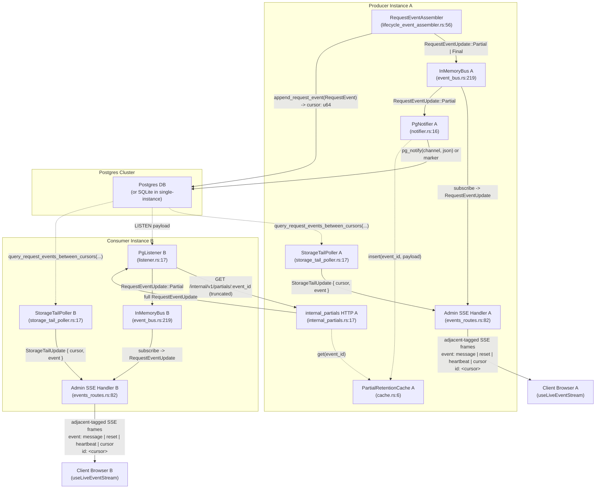

# Live-Tail Architecture

## Overview

The live-tail system provides real-time request logging and metrics streaming for the cc-lb admin dashboard. It uses a storage-first-write and subscribe-then-drain design to guarantee three core invariants. First, I1 ensures a truthful live indicator, meaning the dashboard's live state matches the actual SSE stream receiving fresh data within a bounded window. Second, I2 guarantees lossless delivery of durable final request rows from mount, including across disconnects, server restarts, and load-balancer failovers. In-flight partial snapshots are memory-only, best-effort updates: they are not replayed from storage and do not survive a producer restart. Third, I3 establishes that final-row guarantees are structural, built directly into the cursor protocol and write ordering, rather than relying on ad-hoc client polling. By writing final events to storage before broadcasting them, the system creates a single durable source of truth for the resumable event sequence.

## Component Diagram



## Sequence Diagram: Full Request Lifecycle

```mermaid
sequenceDiagram
    autonumber
    actor Client as Client (SSE Browser)
    participant Admin as Admin API
    participant Storage as Storage
    participant Assembler as LifecycleAssembler
    participant Bus as InMemoryBus
    participant Notifier as PgNotifier
    participant Listener as PgListener (Instance B)
    participant CBus as Consumer InMemoryBus
    participant CAdmin as Consumer Admin API
    actor CClient as Consumer Client

    %% Handshake & Backfill
    Client->>Admin: GET /admin/events/stream (Last-Event-ID)
    Admin->>Storage: current_request_event_cursor()
    Storage-->>Admin: current_cursor
    Admin->>Storage: query_request_events_between_cursors(start, current, 500)
    Storage-->>Admin: backfill events
    Admin->>Client: emit backfilled events
    Note over Client,Admin: I2 Lossless: Backfill drain ensures no events are missed from mount
    Admin->>Client: event: cursor, id: <current>
    Note over Client,Admin: I1 Truthful Live: event: cursor bookmark IS the truth of live

    %% Live Event Flow (Local)
    Note over Assembler: Proxy request lands; Lifecycle events observed
    loop 8 Memory-Only Emission Triggers
        Assembler->>Bus: RequestEventUpdate::Partial
        Bus->>Admin: RequestEventUpdate::Partial
        Admin->>Client: SSE frame (event: message, id: last_finalized_cursor)
        Bus->>Notifier: RequestEventUpdate::Partial
        alt Fits inline (< 7500 bytes)
            Notifier->>Listener: pg_notify(channel, json)
        else Truncated (>= 7500 bytes)
            Notifier->>Notifier: retention.insert(event_id, payload)
            Notifier->>Listener: pg_notify(channel, marker)
            Listener->>Admin: GET /internal/v1/partials/<event_id> (X-Cluster-Token)
            Admin-->>Listener: full RequestEventUpdate
        end
        Listener->>CBus: RequestEventUpdate::Partial
        CBus->>CAdmin: RequestEventUpdate::Partial
        CAdmin->>CClient: SSE frame (event: message, id: last_finalized_cursor)
    end

    Note over Assembler,Bus: Triggers are request_started, parse_completed, auth_completed, route_completed, upstream_response_started, usage_observed, stream_completed, and request_terminated; partial snapshots are never persisted

    %% Finalization
    Assembler->>Storage: append_request_event(RequestEvent)
    Storage-->>Assembler: cursor
    Note over Assembler,Storage: I3 Structural: Storage-first-write guarantees monotonic ordering
    Assembler->>Bus: RequestEventUpdate::Final { event, cursor }
    Bus->>Admin: RequestEventUpdate::Final
    Admin->>Client: SSE frame (event: message, id: cursor)
    Note over Client,Admin: Cursor advances only on finalized storage-tail delivery

    %% Cross-instance Final Delivery via Storage Tail
    Note over Listener,CBus: StorageTailPoller B polls Postgres for new finalized events
    Listener->>Storage: query_request_events_between_cursors(last_seen, current, 500)
    Storage-->>Listener: StorageTailUpdate { cursor, event }
    Listener->>CBus: StorageTailUpdate { cursor, event }
    CBus->>CAdmin: StorageTailUpdate { cursor, event }
    CAdmin->>CClient: SSE frame (event: message, id: cursor)
    Note over CClient,CAdmin: storage-tail ensures no gap in cross-instance final delivery
```

## Reset Reasons and Protocol Invariants

### Reset Reasons

The server emits an `event: reset` frame to force the client to clear its local state and resync from scratch. This happens under three specific conditions:

1. `backfill_cap`: The client's `Last-Event-ID` is more than 500 cursors behind the current head. Replaying a larger gap from storage would place excessive load on the database. The client should clear its state and perform a REST-delta backfill from the current head. This limit is defined by `BACKFILL_MAX_EVENTS = 500` in [`crates/cc-lb-admin/src/events.rs`](../crates/cc-lb-admin/src/events.rs#L22).
2. `bus_lagged`: The SSE subscriber's tokio broadcast receiver lags behind the publisher, resulting in a `Lagged(n)` error. This indicates that the consumer instance or client connection is slower than the event emission rate.
3. `storage_error`: The storage tail poll fails due to database health issues or query timeouts.

### Protocol Invariants

- **Event ID Unification**: The `event_id` is a single, lifecycle-generated UUID v7 key that is threaded through the entire pipeline. It identifies the request from the initial partial update to the final database row and the SSE frame `id:`. This prevents duplicate rows and ensures consistent identity, as described in the live-tail redesign plan §3.7.
- **Cursor Semantics**: The `last_finalized_cursor` advances only from ordered storage-tail delivery. Local bus events (both partial and final) are emitted immediately to minimize latency, but they do not advance the client's resume watermark. This is because local bus events can race with the storage tail. The client uses the cursor to resume the stream safely without missing durable final rows, as implemented in [`handle_events_stream`](../crates/cc-lb-admin/src/events_routes.rs#L84).

## See Also

- [Dashboard Live-Tail Redesign Plan](../.omo/plans/dashboard-live-tail-redesign.md)
- [Live-Tail Post-Deployment Follow-ups Plan](../.omo/plans/live-tail-followups.md)
- [Live-Tail Grafana Dashboard Guide](live-tail-dashboard.md)
- [Live-Tail Load Testing Guide](live-tail-load-testing.md)
